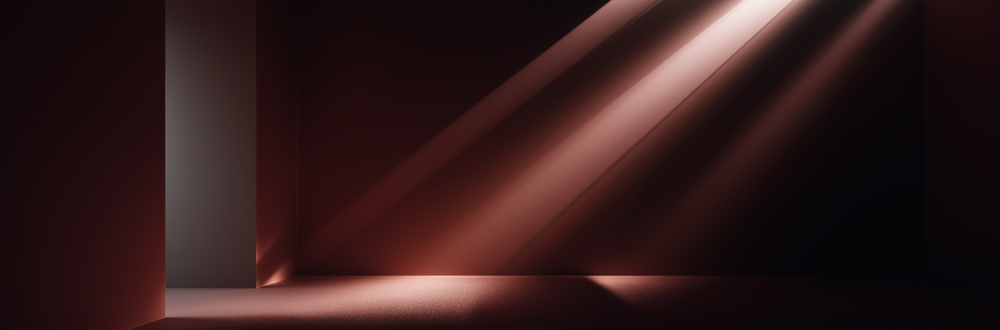
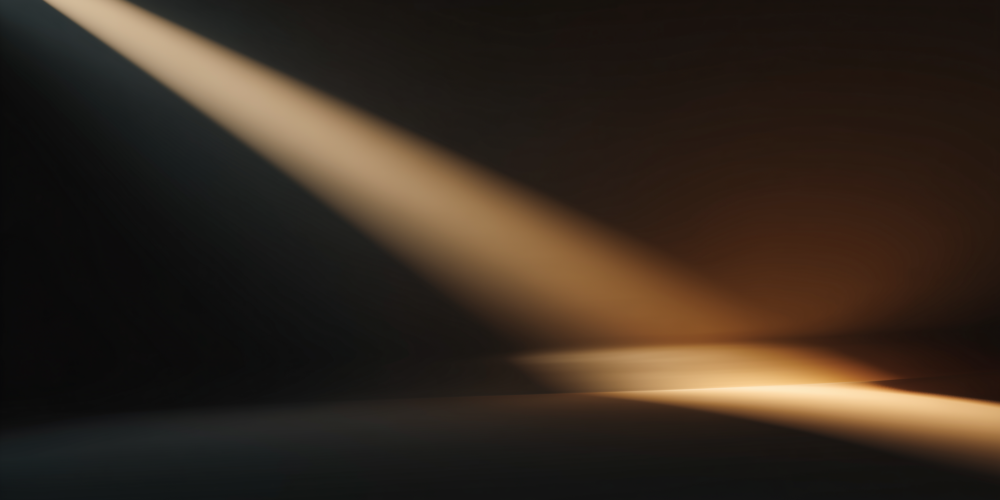
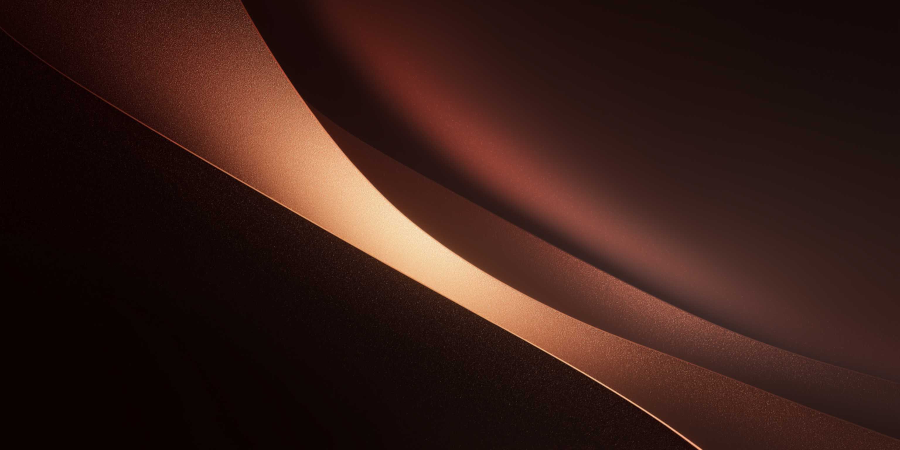

# Omarchy Biscuit de Mar Dark Theme

Biscuit de Mar dark is a colorscheme by [abb3v](https://github.com/abb3v/abb3v) I have applied it to this Omarchy theme and canonized the color asignments to be as official as possible. [abb3v](https://github.com/abb3v/abb3v) describes the de Mar varient as follows:

"Biscuit de Mar - "Biscuit from the Sea" - is what happens when Biscoito ventures too close to the shoreline! Imagine our brave little biscuit getting caught in the gentle waves. As the water washes over him, his colors become softer, more muted, and take on a sandy, coastal quality. The result is a palette with a washed-out, serene character that's perfect for designs requiring a more subtle, relaxed aesthetic."

## Preview


## Install

Use the Omarchy theme installer:

```bash
omarchy-theme-install https://github.com/OldJobobo/omarchy-biscuit-de-mar-dark-theme
```


## Wallpapers

<table>
  <tr>
    <td></td>
    <td></td>
    <td></td>
  </tr>
  <tr>
    <td></td>
    <td></td>
    <td></td>
  </tr>
  <tr>
    <td></td>
    <td></td>
    <td></td>
  </tr>
  <tr>
    <td></td>
    <td></td>
    <td></td>
  </tr>
</table>


## Notes

- `hyprland.conf` sets themed active/inactive border colors and light blur values.
- `neovim.lua` targets the Biscuit Neovim colorscheme and applies popup/completion highlight overrides.
- The palette is centralized in `colors.toml` and reflected in `colors.css` for cross-app consistency.

## Attribution

- Base16 scheme `Biscuit de Mar (Dark)` by `tsukki9696` (`biscuit-mar-dark-base16.yaml`)
- btop theme variant by OldJobobo (`btop.theme`)
- Biscuit Cava theme: <https://github.com/Biscuit-Theme/cava> (`cava_theme`)
- Biscuit Neovim theme: <https://github.com/Biscuit-Theme/nvim>
- Theme packaging, palette adaptation, and wallpapers: <https://github.com/OldJobobo>

## Donate

- If you enjoy what I do, consider supporting me on Ko-fi! Every little bit means the world! https://ko-fi.com/oldjobobo
